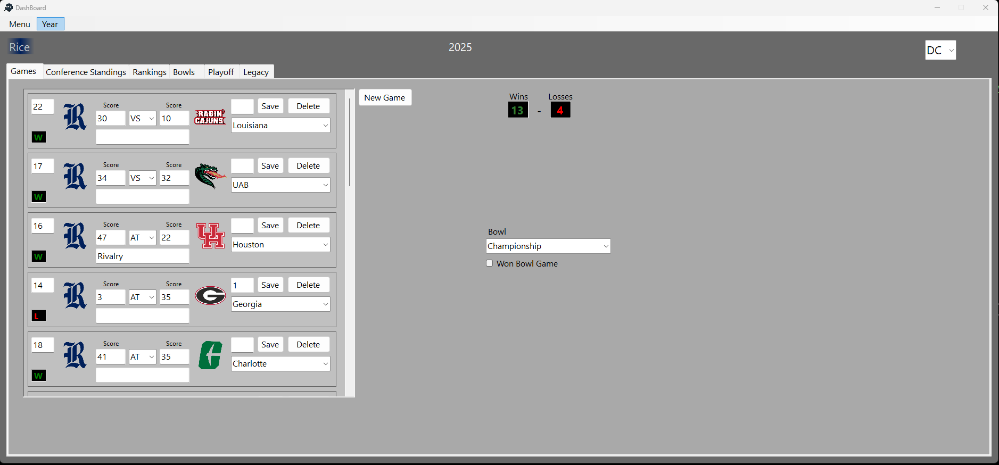
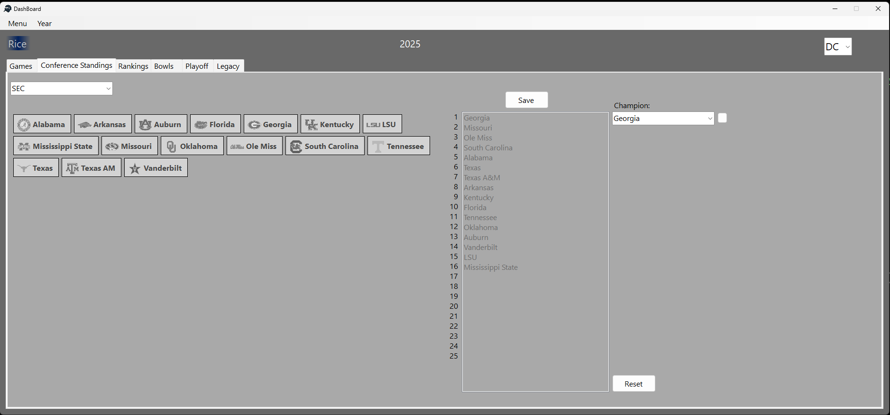
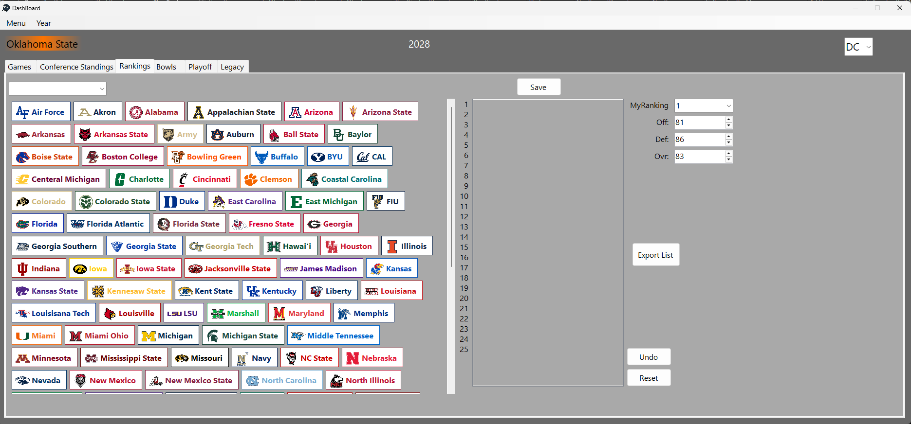
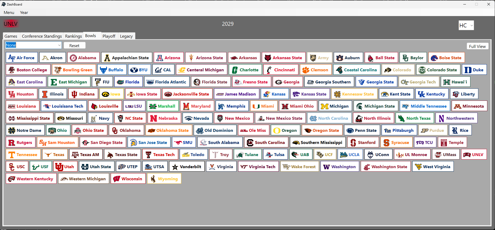
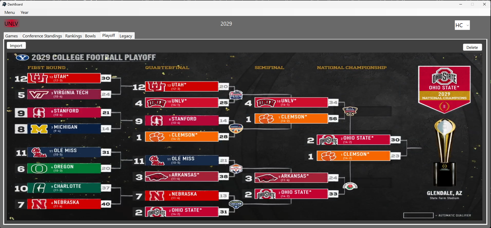
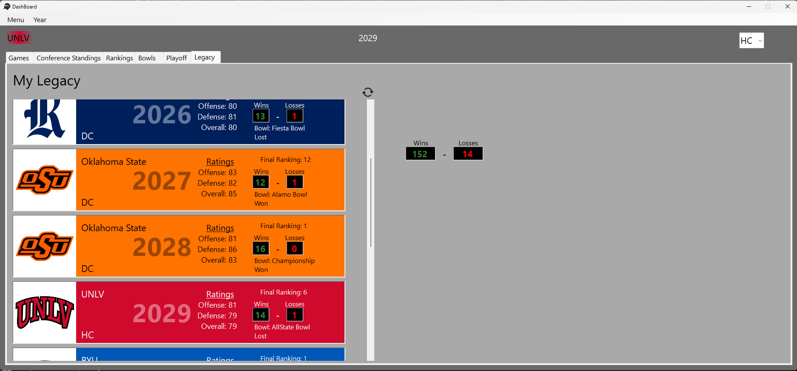

# College Football Dynasty Manager

A desktop application for managing college football seasons, teams, rankings, and coaching careers. Designed to simulate the experience of running a college football program, tracking stats, team changes, and bowl outcomes over multiple years.

NOTE: If you have issues running the app please report it [Here](https://github.com/Lou34964/College-Football-Manager/issues/new).

## 🛠 Tech Stack

- C#
- .NET WinForms
- XML & Text File Storage
- Custom UI with team logos and colors

## 🎮 Features

- Manage real or custom teams with dynamic conference assignments
- Track team stats, standings, and national rankings by season (Some features not complete)
- Bowl game system with custom outcomes and historical tracking
- Coaching career mode with goals and school history (Some features not complete)
- Save/load full dynasty states using XML
- Responsive UI styled using team colors and logos

## 📁 Project Structure

```
/Icon/              -Location for storing all team and app icons/logos
/MetaSettings/      -Contains Forms and Classes for Team Data and app Settings.
/CFPImages/         -Location the app stores image files for the playoff that the user imports for each year.
/Popups/            -Borderless Forms act like popups designed for quick use. windows that do not presist.
/Years/             -Location where all XML files containing all data for each year.

DB file(s) are for future updates.
```

## ⚠️ Disclaimer

This app uses logos of real college football teams for demonstration purposes only.  
All logos and trademarks are the property of their respective owners.  
This project is **non-commercial** and intended for **educational/personal use only**.

## 📸 Screenshots








## 🚀 Getting Started

1. Clone the repo
2. Open the solution file in Visual Studio - Note: app is designed for lang version .NET 8.0+
3. Build & run the app

> Optionally: drop your own team logos into `icons folder` then when creating team select the file.

## 📝 License

This project is licensed under the MIT License — see `LICENSE` file for details.
